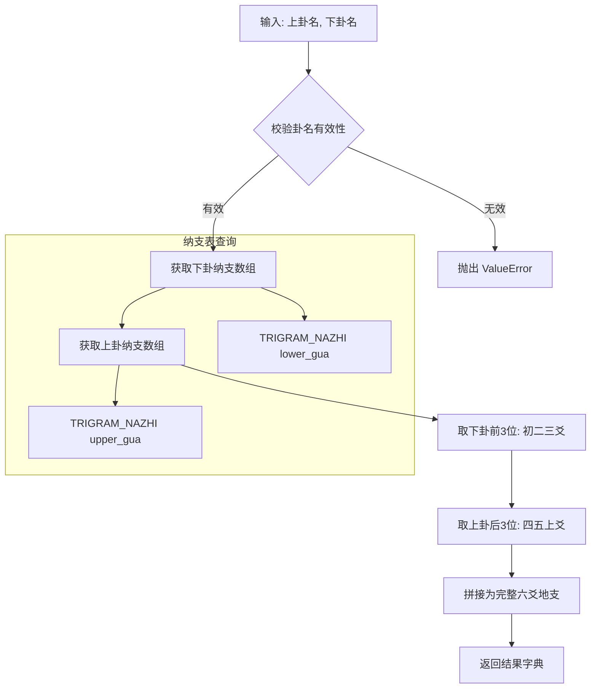

# 地支算法模块 (di_zhi) 实现计划

## 一、模块概述

根据用户需求，创建 `di_zhi` 模块，用于计算六爻地支。该模块严格遵循传统六爻纳支规则，与动爻、日辰、六神无关，同一卦的地支永远固定不变。

## 二、核心规则

### 2.1 拆分规则
- **下卦（内卦）** → 决定 初爻、二爻、三爻
- **上卦（外卦）** → 决定 四爻、五爻、上爻

### 2.2 八卦纳支表（绝对固定）

```python
# 经卦 → [初爻, 二爻, 三爻, 四爻, 五爻, 上爻]
TRIGRAM_NAZHI = {
    "乾": ["子", "寅", "辰", "午", "申", "戌"],
    "震": ["子", "寅", "辰", "午", "申", "戌"],
    "坎": ["寅", "辰", "午", "申", "戌", "子"],
    "艮": ["辰", "午", "申", "戌", "子", "寅"],
    "坤": ["未", "巳", "卯", "丑", "亥", "酉"],
    "巽": ["丑", "亥", "酉", "未", "巳", "卯"],
    "离": ["卯", "丑", "亥", "酉", "未", "巳"],
    "兑": ["巳", "卯", "丑", "亥", "酉", "未"],
}
```

### 2.3 算法逻辑
1. 输入：上卦名、下卦名（从 gua64 模块获取）
2. 取下卦的前 3 位地支 → 初、二、三爻
3. 取上卦的后 3 位地支 → 四、五、上爻
4. 拼接后 = 完整六爻地支

## 三、模块结构

```
di_zhi/
├── __init__.py    # 模块入口，导出公共接口
├── core.py        # 核心计算逻辑
├── utils.py       # 格式化输出函数
└── README.md      # 模块文档

test/
└── test_di_zhi.py # 测试文件（放在test文件夹下）
```

## 四、文件详细设计

### 4.1 core.py - 核心计算模块

```python
# -*- coding: utf-8 -*-
"""
六爻地支核心算法模块

根据上下经卦获取六爻固定地支。

核心规则：
1. 六爻地支终身固定：同一卦的地支永远不变
2. 下卦（内卦）决定初爻、二爻、三爻
3. 上卦（外卦）决定四爻、五爻、上爻
"""

from typing import Dict, List

# =============================================================================
# 常量定义
# =============================================================================

# 八卦纳支表（绝对固定，不可修改）
# 格式：经卦名 -> [初爻, 二爻, 三爻, 四爻, 五爻, 上爻]
TRIGRAM_NAZHI = {
    "乾": ["子", "寅", "辰", "午", "申", "戌"],
    "震": ["子", "寅", "辰", "午", "申", "戌"],
    "坎": ["寅", "辰", "午", "申", "戌", "子"],
    "艮": ["辰", "午", "申", "戌", "子", "寅"],
    "坤": ["未", "巳", "卯", "丑", "亥", "酉"],
    "巽": ["丑", "亥", "酉", "未", "巳", "卯"],
    "离": ["卯", "丑", "亥", "酉", "未", "巳"],
    "兑": ["巳", "卯", "丑", "亥", "酉", "未"],
}

# 有效的卦名列表
VALID_TRIGRAMS = list(TRIGRAM_NAZHI.keys())

# 爻位名称
YAO_NAMES = ["初爻", "二爻", "三爻", "四爻", "五爻", "上爻"]

# =============================================================================
# 核心函数
# =============================================================================

def validate_trigram(trigram: str) -> None:
    """
    校验卦名是否有效
    
    Args:
        trigram: 卦名（乾/兑/离/震/巽/坎/艮/坤）
    
    Raises:
        ValueError: 无效卦名时抛出异常
    """
    if not isinstance(trigram, str):
        raise ValueError(
            f"无效的卦名类型，请输入字符串类型的卦名。"
            f"有效卦名：乾、兑、离、震、巽、坎、艮、坤"
        )
    
    trigram = trigram.strip()
    
    if trigram not in VALID_TRIGRAMS:
        raise ValueError(
            f"无效的卦名'{trigram}'，请输入八卦之一："
            f"乾、兑、离、震、巽、坎、艮、坤"
        )


def get_six_yao_di_zhi(upper_gua: str, lower_gua: str) -> Dict:
    """
    根据上下经卦获取六爻固定地支
    
    Args:
        upper_gua: 上卦名（乾/兑/离/震/巽/坎/艮/坤）
        lower_gua: 下卦名（乾/兑/离/震/巽/坎/艮/坤）
    
    Returns:
        dict: {
            "di_zhi": ["子", "寅", "辰", "午", "申", "戌"],
            "upper_gua": upper_gua,
            "lower_gua": lower_gua
        }
    
    Raises:
        ValueError: 无效卦名时抛出异常
    
    Examples:
        >>> get_six_yao_di_zhi("乾", "乾")
        {"di_zhi": ["子", "寅", "辰", "午", "申", "戌"], "upper_gua": "乾", "lower_gua": "乾"}
        
        >>> get_six_yao_di_zhi("巽", "乾")
        {"di_zhi": ["子", "寅", "辰", "未", "巳", "卯"], "upper_gua": "巽", "lower_gua": "乾"}
    """
    # 校验输入
    validate_trigram(upper_gua)
    validate_trigram(lower_gua)
    
    # 获取上下卦的纳支数组
    upper_nazhi = TRIGRAM_NAZHI[upper_gua]
    lower_nazhi = TRIGRAM_NAZHI[lower_gua]
    
    # 拼接六爻地支
    # 下卦前3位 -> 初、二、三爻
    # 上卦后3位 -> 四、五、上爻
    di_zhi = lower_nazhi[:3] + upper_nazhi[3:]
    
    return {
        "di_zhi": di_zhi,
        "upper_gua": upper_gua,
        "lower_gua": lower_gua
    }


def get_yao_di_zhi(upper_gua: str, lower_gua: str, yao_index: int) -> str:
    """
    获取指定爻位的地支
    
    Args:
        upper_gua: 上卦名
        lower_gua: 下卦名
        yao_index: 爻位索引（0-5，0=初爻，5=上爻）
    
    Returns:
        str: 该爻位的地支
    
    Raises:
        ValueError: 无效爻位索引时抛出异常
    """
    if not isinstance(yao_index, int) or yao_index < 0 or yao_index > 5:
        raise ValueError(
            f"无效的爻位索引'{yao_index}'，请输入0-5的整数"
        )
    
    result = get_six_yao_di_zhi(upper_gua, lower_gua)
    return result["di_zhi"][yao_index]
```

### 4.2 utils.py - 格式化输出模块

```python
# -*- coding: utf-8 -*-
"""
六爻地支辅助函数模块

提供格式化输出和显示功能。
"""

from .core import YAO_NAMES, get_six_yao_di_zhi


def format_di_zhi_result(result: Dict) -> str:
    """
    格式化输出六爻地支结果
    
    Args:
        result: get_six_yao_di_zhi() 返回的结果字典
    
    Returns:
        str: 格式化后的字符串
    
    Examples:
        >>> result = get_six_yao_di_zhi("乾", "乾")
        >>> print(format_di_zhi_result(result))
        上卦：乾 | 下卦：乾
        ────────────────
        初爻：子
        二爻：寅
        三爻：辰
        四爻：午
        五爻：申
        上爻：戌
    """
    lines = []
    
    # 基本信息
    lines.append(f"上卦：{result['upper_gua']} | 下卦：{result['lower_gua']}")
    lines.append("─" * 20)
    
    # 六爻地支
    for yao_name, di_zhi in zip(YAO_NAMES, result['di_zhi']):
        lines.append(f"{yao_name}：{di_zhi}")
    
    return "\n".join(lines)


def print_di_zhi_result(result: Dict):
    """
    打印六爻地支结果
    
    Args:
        result: get_six_yao_di_zhi() 返回的结果字典
    """
    print(format_di_zhi_result(result))


def format_di_zhi_table(result: Dict) -> str:
    """
    以表格形式格式化六爻地支结果
    
    Args:
        result: get_six_yao_di_zhi() 返回的结果字典
    
    Returns:
        str: 表格形式的字符串
    """
    lines = []
    
    # 表头
    lines.append("┌" + "─" * 8 + "┬" + "─" * 8 + "┐")
    lines.append("│  爻位  │  地支  │")
    lines.append("├" + "─" * 8 + "┼" + "─" * 8 + "┤")
    
    # 表体
    for yao_name, di_zhi in zip(YAO_NAMES, result['di_zhi']):
        lines.append(f"│ {yao_name:^6} │ {di_zhi:^6} │")
    
    # 表尾
    lines.append("└" + "─" * 8 + "┴" + "─" * 8 + "┘")
    
    return "\n".join(lines)


def format_di_zhi_with_gua_name(result: Dict, gua_name: str) -> str:
    """
    带卦名的格式化输出
    
    Args:
        result: get_six_yao_di_zhi() 返回的结果字典
        gua_name: 64卦名称
    
    Returns:
        str: 格式化后的字符串
    """
    lines = []
    
    lines.append(f"卦象：{gua_name}")
    lines.append(f"上卦：{result['upper_gua']} | 下卦：{result['lower_gua']}")
    lines.append("六爻地支：")
    
    for yao_name, di_zhi in zip(YAO_NAMES, result['di_zhi']):
        lines.append(f"{yao_name}：{di_zhi}")
    
    return "\n".join(lines)
```

### 4.3 __init__.py - 模块入口

```python
# -*- coding: utf-8 -*-
"""
六爻地支模块

根据上下经卦计算六爻固定地支。

核心规则：
1. 六爻地支终身固定：同一卦的地支永远不变
2. 下卦（内卦）决定初爻、二爻、三爻
3. 上卦（外卦）决定四爻、五爻、上爻

使用方法：
    from di_zhi import get_six_yao_di_zhi, format_di_zhi_result
    
    # 基本用法
    result = get_six_yao_di_zhi("乾", "乾")
    print(format_di_zhi_result(result))
    
    # 与 gua64 模块集成
    from gua64 import calculate_gua
    gua = calculate_gua([1, 1, 1, 1, 1, 1])
    result = get_six_yao_di_zhi(
        gua["ben_gua"]["upper_gua"],
        gua["ben_gua"]["lower_gua"]
    )
"""

from .core import (
    TRIGRAM_NAZHI,
    VALID_TRIGRAMS,
    YAO_NAMES,
    validate_trigram,
    get_six_yao_di_zhi,
    get_yao_di_zhi,
)

from .utils import (
    format_di_zhi_result,
    print_di_zhi_result,
    format_di_zhi_table,
    format_di_zhi_with_gua_name,
)

__all__ = [
    # 常量
    'TRIGRAM_NAZHI',
    'VALID_TRIGRAMS',
    'YAO_NAMES',
    # 核心函数
    'validate_trigram',
    'get_six_yao_di_zhi',
    'get_yao_di_zhi',
    # 辅助函数
    'format_di_zhi_result',
    'print_di_zhi_result',
    'format_di_zhi_table',
    'format_di_zhi_with_gua_name',
]

__version__ = '1.0.0'
__author__ = '六爻起卦系统'
```

## 五、测试用例

```python
# test_di_zhi.py

import unittest
from di_zhi import get_six_yao_di_zhi, validate_trigram, format_di_zhi_result


class TestDiZhi(unittest.TestCase):
    """六爻地支模块测试"""
    
    def test_qian_wei_tian(self):
        """测试乾为天（上乾下乾）"""
        result = get_six_yao_di_zhi("乾", "乾")
        self.assertEqual(result["di_zhi"], ["子", "寅", "辰", "午", "申", "戌"])
        self.assertEqual(result["upper_gua"], "乾")
        self.assertEqual(result["lower_gua"], "乾")
    
    def test_feng_tian_xiao_chu(self):
        """测试风天小畜（上巽下乾）"""
        result = get_six_yao_di_zhi("巽", "乾")
        self.assertEqual(result["di_zhi"], ["子", "寅", "辰", "未", "巳", "卯"])
        self.assertEqual(result["upper_gua"], "巽")
        self.assertEqual(result["lower_gua"], "乾")
    
    def test_kun_wei_di(self):
        """测试坤为地（上坤下坤）"""
        result = get_six_yao_di_zhi("坤", "坤")
        self.assertEqual(result["di_zhi"], ["未", "巳", "卯", "丑", "亥", "酉"])
        self.assertEqual(result["upper_gua"], "坤")
        self.assertEqual(result["lower_gua"], "坤")
    
    def test_invalid_trigram(self):
        """测试无效卦名"""
        with self.assertRaises(ValueError):
            get_six_yao_di_zhi("无效", "乾")
        
        with self.assertRaises(ValueError):
            get_six_yao_di_zhi("乾", 123)
    
    def test_validate_trigram(self):
        """测试卦名校验"""
        # 有效卦名不应抛出异常
        validate_trigram("乾")
        validate_trigram("坤")
        
        # 无效卦名应抛出异常
        with self.assertRaises(ValueError):
            validate_trigram("无效")


if __name__ == "__main__":
    unittest.main()
```

## 六、与现有项目集成示例

```python
from gua64 import calculate_gua
from di_zhi import get_six_yao_di_zhi, format_di_zhi_result

# 1. 先算卦象
gua = calculate_gua([1, 1, 1, 1, 1, 1])
upper = gua["ben_gua"]["upper_gua"]
lower = gua["ben_gua"]["lower_gua"]

# 2. 计算地支
result = get_six_yao_di_zhi(upper, lower)

# 3. 格式化输出
print(f"卦象：{gua['ben_gua']['name']}")
print(format_di_zhi_result(result))
```

## 七、算法流程图



## 八、代码规范

1. **仅使用 Python 内置库**，无第三方依赖
2. **校验输入卦名**，无效时抛出 `ValueError`
3. **与现有模块命名、格式完全统一**
4. **代码简洁、注释清晰、可直接上线使用**
5. **遵循 PEP 8 编码规范**
6. **使用 UTF-8 编码，支持中文**

## 九、文件创建清单

| 序号 | 文件路径 | 说明 |
|------|----------|------|
| 1 | `di_zhi/__init__.py` | 模块入口 |
| 2 | `di_zhi/core.py` | 核心计算逻辑 |
| 3 | `di_zhi/utils.py` | 格式化输出函数 |
| 4 | `di_zhi/README.md` | 模块文档 |
| 5 | `test/test_di_zhi.py` | 测试文件（放在test文件夹下） |

## 十、main.py 集成方案

### 10.1 导入模块

在 main.py 顶部添加导入：

```python
from di_zhi import (
    get_six_yao_di_zhi,
    format_di_zhi_simple,
)
```

### 10.2 显示位置

在世应信息显示后面添加地支显示，参考现有代码结构：

```python
# 显示世应信息
gua_name = gua['ben_gua']['gua64_name']
shi_ying = get_shi_ying(gua_name)
print(f"世爻: {get_yao_name(shi_ying['shi'])}（第{shi_ying['shi']}爻）")
print(f"应爻: {get_yao_name(shi_ying['ying'])}（第{shi_ying['ying']}爻）")

# 显示地支信息（新增）
upper_gua = gua['ben_gua']['upper_gua']
lower_gua = gua['ben_gua']['lower_gua']
di_zhi_result = get_six_yao_di_zhi(upper_gua, lower_gua)
print(f"地支: {' '.join(di_zhi_result['di_zhi'])}")
```

### 10.3 需要修改的函数

在 main.py 中需要修改以下函数，添加地支显示：

1. `biao_di_wu_menu()` - 标的物起卦菜单（约第88-92行后添加）
2. `display_coin_result()` - 硬币起卦结果显示（约第208-212行后添加）
3. `number_menu()` - 数字起卦菜单（约第271-275行后添加）

### 10.4 显示格式

地支显示格式与世应保持一致风格：

```
世爻: 上爻（第6爻）
应爻: 三爻（第3爻）
地支: 子 寅 辰 午 申 戌
```

或者更详细的格式：

```
世爻: 上爻（第6爻）
应爻: 三爻（第3爻）
地支: 初爻子 二爻寅 三爻辰 四爻午 五爻申 上爻戌
```