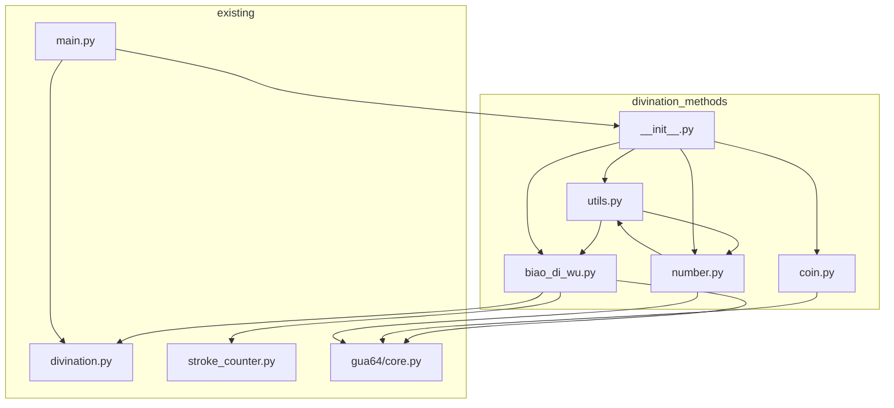

# 起卦方式重构计划

## 概述

将 `divination.py` 中的三种起卦方式（标的物起卦、硬币起卦、数字起卦）迁移到新的 `divination_methods` 文件夹中，辅助函数放在公共模块中。

## 当前结构

```
6yao/
├── divination.py          # 包含所有起卦方式和辅助函数
├── main.py                # 主程序，调用起卦函数
└── test/
    ├── test_divination.py
    └── test_coin_divination.py
```

## 目标结构

```
6yao/
├── divination.py          # 保留时间起卦、随机起卦等，导入新模块
├── divination_methods/    # 新建文件夹
│   ├── __init__.py        # 导出所有函数
│   ├── utils.py           # 公共辅助函数
│   ├── biao_di_wu.py      # 标的物起卦
│   ├── coin.py            # 硬币起卦
│   └── number.py          # 数字起卦
├── main.py                # 更新导入路径
└── test/
    ├── test_divination.py
    └── test_coin_divination.py
```

## 函数迁移详情

### 1. divination_methods/utils.py - 公共辅助函数

从 `divination.py` 迁移以下函数：

| 函数名 | 说明 |
|--------|------|
| `GUA_NAMES` | 八卦对应表（常量） |
| `GUA_BINARIES` | 八卦二进制表示（常量） |
| `gua_to_yao_list()` | 将上下卦转换为六爻列表 |
| `get_yao_description()` | 获取六爻描述 |

### 2. divination_methods/biao_di_wu.py - 标的物起卦

从 `divination.py` 迁移以下函数：

| 函数名 | 说明 |
|--------|------|
| `biao_di_wu_divination()` | 标的物起卦（笔画+日时） |

**依赖**：
- `divination_methods.utils.gua_to_yao_list`
- `divination.get_lunar_datetime`（保留在原处）
- `divination.get_year_zhi`（保留在原处）
- `divination.get_shi_ke`（保留在原处）
- `stroke_counter.get_text_stroke`, `get_traditional`
- `gua64.calculate_gua`

### 3. divination_methods/coin.py - 硬币起卦

从 `divination.py` 迁移以下函数：

| 函数名 | 说明 |
|--------|------|
| `coin_toss_to_yao()` | 将抛硬币结果转换为一爻 |
| `coin_divination()` | 硬币起卦 |
| `auto_coin_divination()` | 系统自动抛硬币起卦 |

**依赖**：
- `gua64.calculate_gua`
- `random`（标准库）

### 4. divination_methods/number.py - 数字起卦

从 `divination.py` 迁移以下函数：

| 函数名 | 说明 |
|--------|------|
| `number_divination_v2()` | 数字起卦（上下卦分开输入） |

**依赖**：
- `divination_methods.utils.gua_to_yao_list`
- `gua64.calculate_gua`

### 5. divination_methods/__init__.py

导出所有公共函数：

```python
from .utils import GUA_NAMES, GUA_BINARIES, gua_to_yao_list, get_yao_description
from .biao_di_wu import biao_di_wu_divination
from .coin import coin_toss_to_yao, coin_divination, auto_coin_divination
from .number import number_divination_v2
```

### 6. divination.py 修改

保留以下内容：
- `get_lunar_datetime()` - 获取农历日期
- `get_year_zhi()` - 获取年支数
- `get_day_tiangan()` - 获取日天干
- `get_shi_ke()` - 获取时辰数
- `time_divination()` - 时间起卦（梅花易数）
- `random_divination()` - 随机起卦
- `DI_ZHI`, `DI_ZHI_LIST`, `TIAN_GAN_LIST` 常量
- 测试函数 `test_divination()`

添加导入：
```python
from divination_methods import (
    biao_di_wu_divination,
    coin_toss_to_yao,
    coin_divination,
    auto_coin_divination,
    number_divination_v2,
    GUA_NAMES,
    GUA_BINARIES,
    gua_to_yao_list,
    get_yao_description
)
```

## 需要更新的文件

### main.py

**当前导入**：
```python
from divination import (
    biao_di_wu_divination,
    coin_divination,
    auto_coin_divination,
    number_divination_v2,
    get_day_tiangan,
    GUA_NAMES
)
```

**更新后导入**：
```python
from divination import get_day_tiangan
from divination_methods import (
    biao_di_wu_divination,
    coin_divination,
    auto_coin_divination,
    number_divination_v2,
    GUA_NAMES
)
```

### test/test_divination.py

**当前导入**：
```python
from divination import (
    time_divination,
    number_divination,
    manual_divination,
    save_result,
    get_yao_description,
    get_lunar_datetime,
    get_shi_ke
)
```

**注意**：此文件使用了 `number_divination`（旧版），需要确认是否需要更新。

### test/test_coin_divination.py

**当前导入**：
```python
from divination import coin_toss_to_yao, coin_divination, auto_coin_divination
```

**更新后导入**：
```python
from divination_methods import coin_toss_to_yao, coin_divination, auto_coin_divination
```

## 执行步骤

1. 创建 `divination_methods/` 文件夹
2. 创建 `divination_methods/utils.py` - 迁移公共函数和常量
3. 创建 `divination_methods/biao_di_wu.py` - 迁移标的物起卦
4. 创建 `divination_methods/coin.py` - 迁移硬币起卦
5. 创建 `divination_methods/number.py` - 迁移数字起卦
6. 创建 `divination_methods/__init__.py` - 导出所有函数
7. 修改 `divination.py` - 移除迁移的函数，添加导入
8. 更新 `main.py` 的导入路径
9. 更新 `test/test_coin_divination.py` 的导入路径
10. 运行测试验证重构正确性

## 依赖关系图



## 风险评估

1. **循环依赖风险**：`biao_di_wu.py` 需要从 `divination.py` 导入 `get_lunar_datetime`、`get_year_zhi`、`get_shi_ke`，需要确保不会产生循环导入
2. **测试覆盖**：需要确保所有测试文件都能正确更新导入路径
3. **向后兼容**：`divination.py` 需要重新导出迁移的函数，以保持向后兼容

## 解决方案

为避免循环依赖并保持向后兼容，`divination.py` 将：
1. 保留时间相关辅助函数（`get_lunar_datetime`, `get_year_zhi`, `get_shi_ke`, `get_day_tiangan`）
2. 从 `divination_methods` 导入并重新导出迁移的函数
3. 保留 `time_divination` 和 `random_divination` 函数