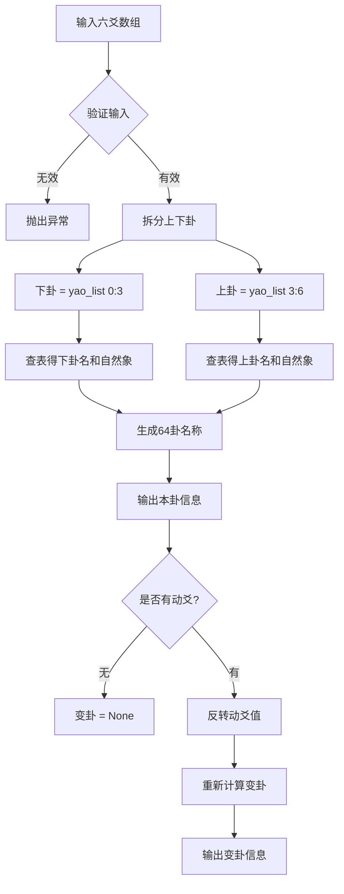

# 64卦算法模块设计文档

## 一、需求概述

根据六爻数组（6个爻的变化）得出对应的64卦卦象，包括本卦和变卦的完整命名。

**关键需求**：在六爻生成后自动呈现卦象信息，集成到现有起卦流程中。

## 二、核心规则

### 2.1 六爻数组格式
- 格式：`[初爻, 二爻, 三爻, 四爻, 五爻, 上爻]`
- 顺序：严格从下到上
- 爻值：`1` = 阳爻，`2` = 阴爻

### 2.2 卦象拆分规则
- 下卦（内卦）= 数组前3位 `[0:3]`：[初爻, 二爻, 三爻]
- 上卦（外卦）= 数组后3位 `[3:6]`：[四爻, 五爻, 上爻]

### 2.3 三爻八卦映射表

| 卦名 | 符号 | 二进制 | 自然象 |
|------|------|--------|--------|
| 乾 | ☰ | [1,1,1] | 天 |
| 兑 | ☱ | [1,1,2] | 泽 |
| 离 | ☲ | [1,2,1] | 火 |
| 震 | ☳ | [1,2,2] | 雷 |
| 巽 | ☴ | [2,1,1] | 风 |
| 坎 | ☵ | [2,1,2] | 水 |
| 艮 | ☶ | [2,2,1] | 山 |
| 坤 | ☷ | [2,2,2] | 地 |

### 2.4 64卦命名规则

**异卦（上下卦不同）**：
- 格式：`上{上卦名}下{下卦名} {上卦自然象}{下卦自然象}{六十四卦专名}卦`
- 示例：上乾下艮 → 天山遁卦

**八纯卦（上下卦相同）**：
- 格式：`上{上卦名}下{下卦名} {卦名}为{自然象}卦`
- 示例：上乾下乾 → 乾为天卦

### 2.5 动爻与变卦规则
- 本卦：仅由原始输入数组决定，动爻不参与本卦判断
- 变卦：将动爻位置的数值反转（1↔2），重新计算卦象

## 三、模块架构设计

```
gua64/
├── __init__.py      # 模块导出
├── core.py          # 核心算法
├── utils.py         # 工具函数
└── README.md        # 模块文档
```

## 四、核心数据结构

### 4.1 八卦映射常量

```python
# 八卦二进制到卦名映射
TRIGRAM_NAMES = {
    (1, 1, 1): "乾",
    (1, 1, 2): "兑",
    (1, 2, 1): "离",
    (1, 2, 2): "震",
    (2, 1, 1): "巽",
    (2, 1, 2): "坎",
    (2, 2, 1): "艮",
    (2, 2, 2): "坤",
}

# 八卦到自然象映射
TRIGRAM_NATURES = {
    "乾": "天",
    "兑": "泽",
    "离": "火",
    "震": "雷",
    "巽": "风",
    "坎": "水",
    "艮": "山",
    "坤": "地",
}
```

### 4.2 64卦名称映射

```python
# 64卦名称表（上卦-下卦 -> 卦名）
GUA64_NAMES = {
    # 乾宫八卦（上卦为乾）
    ("乾", "乾"): "乾为天",
    ("乾", "兑"): "天泽履",
    ("乾", "离"): "天火同人",
    ("乾", "震"): "天雷无妄",
    ("乾", "巽"): "天风姤",
    ("乾", "坎"): "天水讼",
    ("乾", "艮"): "天山遁",
    ("乾", "坤"): "天地否",
    
    # 兑宫八卦（上卦为兑）
    ("兑", "乾"): "泽天夬",
    ("兑", "兑"): "兑为泽",
    # ... 其他56卦
}
```

## 五、核心函数设计

### 5.1 `parse_yao_list(yao_list: list) -> dict`

解析六爻数组，返回上下卦信息。

**输入**：
- `yao_list`: 六爻数组 `[1,1,1,2,1,1]`

**输出**：
```python
{
    "lower_trigram": (1, 1, 1),  # 下卦三爻
    "upper_trigram": (2, 1, 1),  # 上卦三爻
    "lower_gua_name": "乾",
    "upper_gua_name": "巽",
    "lower_nature": "天",
    "upper_nature": "风",
}
```

### 5.2 `get_gua_name(upper_gua: str, lower_gua: str) -> str`

根据上下卦名生成完整卦名。

**输入**：
- `upper_gua`: 上卦名（如"乾"）
- `lower_gua`: 下卦名（如"艮"）

**输出**：
- `"上乾下艮 天山遁卦"`

### 5.3 `calculate_ben_gua(yao_list: list) -> dict`

计算本卦。

**输入**：
- `yao_list`: 六爻数组

**输出**：
```python
{
    "name": "上巽下乾 风天小畜卦",
    "upper_gua": "巽",
    "lower_gua": "乾",
    "upper_nature": "风",
    "lower_nature": "天",
    "gua64_name": "小畜",
}
```

### 5.4 `calculate_bian_gua(yao_list: list, moving_yao: Union[int, list]) -> dict`

计算变卦。

**输入**：
- `yao_list`: 六爻数组
- `moving_yao`: 动爻位置，支持两种格式：
  - `int`: 单个动爻位置（1-6，1=初爻，6=上爻）
  - `list[int]`: 多个动爻位置（如 `[3, 5]` 表示三爻和五爻同时动）
  - `None` 或空列表 `[]`: 无动爻

**重要：索引转换**
```python
# 动爻位置是1-6，Python数组索引是0-5
# 需要做索引转换：
target_index = moving_yao - 1  # moving_yao=3 → index=2
```

**输出**：
```python
{
    "name": "上乾下艮 天山遁卦",
    "upper_gua": "乾",
    "lower_gua": "艮",
    "upper_nature": "天",
    "lower_nature": "山",
    "gua64_name": "遁",
    "changed_yao": [3],  # 变化的爻位列表（支持多动爻）
    "change_detail": "三爻阴变阳，下卦由坤变为艮",
}
```

### 5.5 `calculate_gua(yao_list: list, moving_yao: Union[int, list, None] = None) -> dict`

主函数：计算本卦和变卦。

**输入**：
- `yao_list`: 六爻数组
- `moving_yao`: 动爻位置（可选），支持：
  - `int`: 单个动爻（如 `3`）
  - `list[int]`: 多个动爻（如 `[3, 5]`）
  - `None`: 无动爻

**输出**：
```python
{
    "ben_gua": {
        "name": "上巽下乾 风天小畜卦",
        "upper_gua": "巽",
        "lower_gua": "乾",
        # ...
    },
    "bian_gua": None,  # 无动爻时为None
    "yao_list": [1, 1, 1, 2, 1, 1],
    "moving_yao": None,  # 统一转换为列表格式存储
}
```

## 六、算法流程图



## 七、测试用例

### 测试用例1：无动爻

**输入**：
```python
yao_list = [1, 1, 1, 2, 1, 1]
moving_yao = None
```

**预期输出**：
```python
{
    "ben_gua": {
        "name": "上巽下乾 风天小畜卦",
        "upper_gua": "巽",
        "lower_gua": "乾",
        "upper_nature": "风",
        "lower_nature": "天",
        "gua64_name": "小畜",
    },
    "bian_gua": None,
    "yao_list": [1, 1, 1, 2, 1, 1],
    "moving_yao": None,
}
```

### 测试用例2：有动爻

**输入**：
```python
yao_list = [2, 2, 2, 1, 1, 1]
moving_yao = 3  # 三爻（索引为2）
```

**预期输出**：
```python
{
    "ben_gua": {
        "name": "上乾下坤 天地否卦",
        "upper_gua": "乾",
        "lower_gua": "坤",
        "upper_nature": "天",
        "lower_nature": "地",
        "gua64_name": "否",
    },
    "bian_gua": {
        "name": "上乾下艮 天山遁卦",
        "upper_gua": "乾",
        "lower_gua": "艮",
        "upper_nature": "天",
        "lower_nature": "山",
        "gua64_name": "遁",
        "changed_yao": 3,
        "change_detail": "三爻阴变阳，下卦由坤变为艮",
    },
    "yao_list": [2, 2, 2, 1, 1, 1],
    "moving_yao": 3,
}
```

### 测试用例3：八纯卦

**输入**：
```python
yao_list = [1, 1, 1, 1, 1, 1]
moving_yao = None
```

**预期输出**：
```python
{
    "ben_gua": {
        "name": "上乾下乾 乾为天卦",
        "upper_gua": "乾",
        "lower_gua": "乾",
        "upper_nature": "天",
        "lower_nature": "天",
        "gua64_name": "乾",
    },
    "bian_gua": None,
    "yao_list": [1, 1, 1, 1, 1, 1],
    "moving_yao": None,
}
```

## 八、文件结构

```
gua64/
├── __init__.py          # 模块导出
│   - 导出 calculate_gua, calculate_ben_gua, calculate_bian_gua
│   - 导出常量 TRIGRAM_NAMES, GUA64_NAMES
│
├── core.py              # 核心算法
│   - parse_yao_list()   # 解析六爻数组
│   - get_trigram_name()  # 获取八卦名
│   - get_gua64_name()    # 获取64卦名
│   - calculate_ben_gua() # 计算本卦
│   - calculate_bian_gua()# 计算变卦
│   - calculate_gua()     # 主函数
│
├── utils.py             # 工具函数
│   - validate_yao_list() # 验证输入
│   - flip_yao()          # 反转爻值
│   - format_gua_result() # 格式化输出
│
└── README.md            # 模块文档
    - 使用说明
    - API文档
    - 示例代码
```

## 九、与现有模块的集成

### 9.1 与 divination.py 的关系

现有 `divination.py` 中的 `gua_to_yao_list()` 函数将八卦数字转换为六爻数组，新模块将提供反向功能：从六爻数组得出卦象名称。

### 9.2 与 six_gods 模块的关系

`six_gods` 模块处理六神排盘，新模块 `gua64` 处理卦象计算，两者可以独立使用，也可以组合使用。

### 9.3 集成示例

```python
from divination import time_divination
from gua64 import calculate_gua

# 使用时间起卦
result = time_divination()

# 计算卦象
gua_result = calculate_gua(
    yao_list=result['yao_list'],
    moving_yao=result['moving_yao']
)

print(f"本卦: {gua_result['ben_gua']['name']}")
if gua_result['bian_gua']:
    print(f"变卦: {gua_result['bian_gua']['name']}")
```

## 十、实现优先级

1. **核心功能**：`core.py` 中的核心算法
2. **数据常量**：64卦名称映射表
3. **输入验证**：`utils.py` 中的验证函数
4. **格式化输出**：格式化显示函数
5. **单元测试**：完整的测试覆盖
6. **文档编写**：README 和 API 文档
7. **集成到现有系统**：修改 `divination.py` 和 `main.py`

## 十一、集成方案（六爻生成后自动呈现卦象）

### 11.1 修改 divination.py

在现有起卦函数中增加卦象计算：

```python
from gua64 import calculate_gua

def time_divination(solar_date=None):
    # ... 现有代码 ...
    
    # 生成六爻列表
    yao_list = gua_to_yao_list(upper_gua, lower_gua)
    
    # 新增：计算卦象
    gua_result = calculate_gua(yao_list, moving_yao)
    
    return {
        'upper_gua': upper_gua,
        'lower_gua': lower_gua,
        'moving_yao': moving_yao,
        'yao_list': yao_list,
        'lunar': {...},
        # 新增字段
        'gua_info': gua_result,
    }
```

### 11.2 修改 main.py 显示

在显示结果时增加卦象信息：

```python
def display_divination_result(result):
    print(f"六爻: {result['yao_list']}")
    
    # 新增：显示卦象
    if 'gua_info' in result:
        gua = result['gua_info']
        print(f"本卦: {gua['ben_gua']['name']}")
        if gua['bian_gua']:
            print(f"变卦: {gua['bian_gua']['name']}")
            print(f"变化: {gua['bian_gua']['change_detail']}")
```

### 11.3 集成流程图


### 11.4 需要修改的文件

| 文件 | 修改内容 |
|------|----------|
| `divination.py` | 在各起卦函数中调用 `calculate_gua()` |
| `main.py` | 在显示结果时增加卦象信息输出 |
| `test_divination.py` | 增加卦象计算的测试用例 |