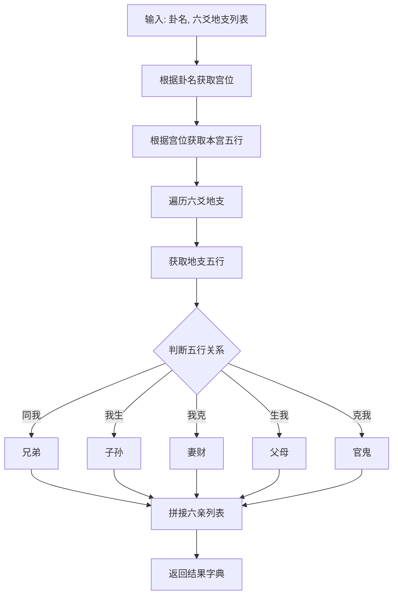
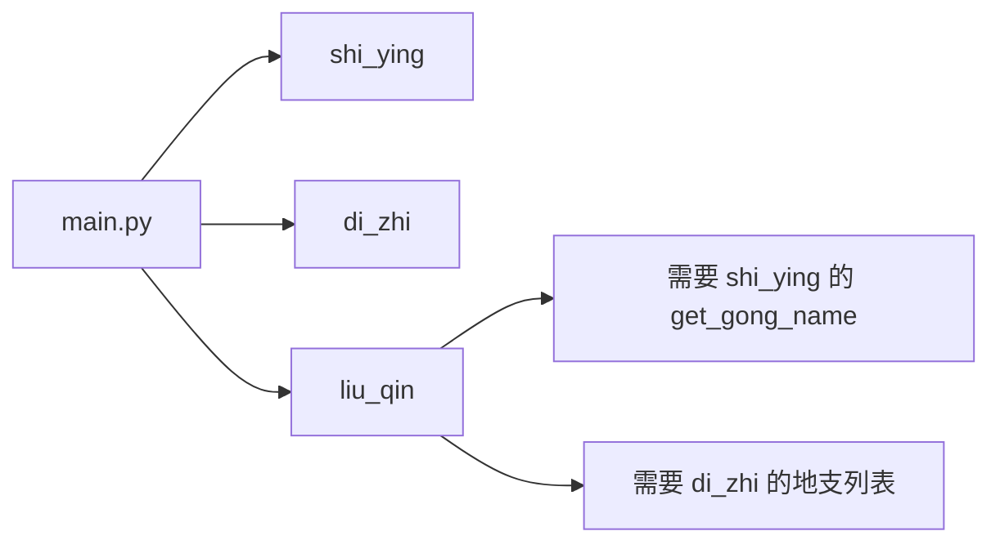

# 六亲算法模块 (liu_qin) 实现计划

## 一、模块概述

根据用户需求，创建 `liu_qin` 模块，用于计算六爻六亲。该模块根据本宫五行和各爻地支五行，按照传统六爻规则推算六亲。

## 二、核心规则

### 2.1 六亲定义

六亲是根据五行生克关系确定的：

| 关系 | 六亲 | 说明 |
|------|------|------|
| 生我者 | 父母 | 生助本宫五行的五行 |
| 我生者 | 子孙 | 本宫五行所生的五行 |
| 克我者 | 官鬼 | 克制本宫五行的五行 |
| 我克者 | 妻财 | 本宫五行所克的五行 |
| 同我者 | 兄弟 | 与本宫五行相同的五行 |

### 2.2 五行生克表

```python
# 五行相生：木生火、火生土、土生金、金生水、水生木
# 五行相克：木克土、土克水、水克火、火克金、金克木

SHENG_KE = {
    "木": {"sheng": "火", "ke": "土", "bei_sheng": "水", "bei_ke": "金"},
    "火": {"sheng": "土", "ke": "金", "bei_sheng": "木", "bei_ke": "水"},
    "土": {"sheng": "金", "ke": "水", "bei_sheng": "火", "bei_ke": "木"},
    "金": {"sheng": "水", "ke": "木", "bei_sheng": "土", "bei_ke": "火"},
    "水": {"sheng": "木", "ke": "火", "bei_sheng": "金", "bei_ke": "土"},
}
```

### 2.3 地支五行表

```python
DI_ZHI_ELEMENT = {
    "子": "水", "丑": "土", "寅": "木", "卯": "木",
    "辰": "土", "巳": "火", "午": "火", "未": "土",
    "申": "金", "酉": "金", "戌": "土", "亥": "水"
}
```

### 2.4 八宫五行表

```python
GONG_ELEMENT = {
    "乾宫": "金",
    "兑宫": "金",
    "离宫": "火",
    "震宫": "木",
    "巽宫": "木",
    "坎宫": "水",
    "艮宫": "土",
    "坤宫": "土",
}
```

### 2.5 算法逻辑

1. 输入：卦名（获取本宫五行）、六爻地支列表
2. 根据卦名获取所属宫位
3. 根据宫位获取本宫五行
4. 遍历六爻地支，获取每个地支的五行
5. 根据本宫五行与爻五行的生克关系，确定六亲

## 三、模块结构

```
liu_qin/
├── __init__.py    # 模块入口，导出公共接口
├── core.py        # 核心计算逻辑
├── utils.py       # 格式化输出函数
└── README.md      # 模块文档

test/
└── test_liu_qin.py # 测试文件（放在test文件夹下）
```

## 四、文件详细设计

### 4.1 core.py - 核心计算模块

```python
# -*- coding: utf-8 -*-
"""
六亲核心算法模块

根据本宫五行和爻地支五行计算六亲。

核心规则：
1. 生我者为父母
2. 我生者为子孙
3. 克我者为官鬼
4. 我克者为妻财
5. 同我者为兄弟
"""

from typing import Dict, List

# =============================================================================
# 常量定义
# =============================================================================

# 五行列表
WUXING_LIST = ["金", "木", "水", "火", "土"]

# 六亲列表
LIU_QIN_LIST = ["父母", "兄弟", "子孙", "妻财", "官鬼"]

# 五行生克关系表
SHENG_KE = {
    "木": {"sheng": "火", "ke": "土", "bei_sheng": "水", "bei_ke": "金"},
    "火": {"sheng": "土", "ke": "金", "bei_sheng": "木", "bei_ke": "水"},
    "土": {"sheng": "金", "ke": "水", "bei_sheng": "火", "bei_ke": "木"},
    "金": {"sheng": "水", "ke": "木", "bei_sheng": "土", "bei_ke": "火"},
    "水": {"sheng": "木", "ke": "火", "bei_sheng": "金", "bei_ke": "土"},
}

# 地支五行表
DI_ZHI_ELEMENT = {
    "子": "水", "丑": "土", "寅": "木", "卯": "木",
    "辰": "土", "巳": "火", "午": "火", "未": "土",
    "申": "金", "酉": "金", "戌": "土", "亥": "水"
}

# 八宫五行表
GONG_ELEMENT = {
    "乾宫": "金",
    "兑宫": "金",
    "离宫": "火",
    "震宫": "木",
    "巽宫": "木",
    "坎宫": "水",
    "艮宫": "土",
    "坤宫": "土",
}

# 爻位名称
YAO_NAMES = ["初爻", "二爻", "三爻", "四爻", "五爻", "上爻"]

# =============================================================================
# 核心函数
# =============================================================================

def get_element_by_di_zhi(di_zhi: str) -> str:
    """
    根据地支获取五行
    
    Args:
        di_zhi: 地支（子/丑/寅/卯/辰/巳/午/未/申/酉/戌/亥）
    
    Returns:
        str: 五行（金/木/水/火/土）
    
    Raises:
        ValueError: 无效地支时抛出异常
    """
    if di_zhi not in DI_ZHI_ELEMENT:
        raise ValueError(f"无效的地支'{di_zhi}'，请输入十二地支之一")
    return DI_ZHI_ELEMENT[di_zhi]


def get_element_by_gong(gong: str) -> str:
    """
    根据宫位获取五行
    
    Args:
        gong: 宫位名（乾宫/兑宫/离宫/震宫/巽宫/坎宫/艮宫/坤宫）
    
    Returns:
        str: 五行（金/木/水/火/土）
    
    Raises:
        ValueError: 无效宫位时抛出异常
    """
    if gong not in GONG_ELEMENT:
        raise ValueError(f"无效的宫位'{gong}'，请输入八宫之一")
    return GONG_ELEMENT[gong]


def get_liu_qin_by_element(self_element: str, yao_element: str) -> str:
    """
    根据本宫五行和爻五行计算六亲
    
    Args:
        self_element: 本宫五行
        yao_element: 爻五行
    
    Returns:
        str: 六亲（父母/兄弟/子孙/妻财/官鬼）
    
    Examples:
        >>> get_liu_qin_by_element("金", "金")  # 同我者
        '兄弟'
        >>> get_liu_qin_by_element("金", "水")  # 我生者
        '子孙'
        >>> get_liu_qin_by_element("金", "土")  # 生我者
        '父母'
        >>> get_liu_qin_by_element("金", "木")  # 我克者
        '妻财'
        >>> get_liu_qin_by_element("金", "火")  # 克我者
        '官鬼'
    """
    if self_element not in SHENG_KE:
        raise ValueError(f"无效的本宫五行'{self_element}'")
    if yao_element not in SHENG_KE:
        raise ValueError(f"无效的爻五行'{yao_element}'")
    
    relation = SHENG_KE[self_element]
    
    if yao_element == self_element:
        return "兄弟"
    elif yao_element == relation["sheng"]:
        return "子孙"
    elif yao_element == relation["ke"]:
        return "妻财"
    elif yao_element == relation["bei_sheng"]:
        return "父母"
    elif yao_element == relation["bei_ke"]:
        return "官鬼"
    else:
        # 理论上不会执行到这里
        raise ValueError(f"无法确定六亲关系")


def get_six_yao_liu_qin(gong: str, di_zhi_list: List[str]) -> Dict:
    """
    计算六爻六亲
    
    Args:
        gong: 宫位名（如"乾宫"）
        di_zhi_list: 六爻地支列表，从初爻到上爻
    
    Returns:
        dict: {
            "liu_qin": ["兄弟", "父母", "妻财", "官鬼", "父母", "子孙"],
            "gong": "乾宫",
            "gong_element": "金",
            "yao_elements": ["金", "水", "木", "火", "土", "水"]
        }
    
    Examples:
        >>> result = get_six_yao_liu_qin("乾宫", ["子", "寅", "辰", "午", "申", "戌"])
        >>> result["liu_qin"]
        ['子孙', '妻财', '兄弟', '官鬼', '父母', '兄弟']
    """
    if len(di_zhi_list) != 6:
        raise ValueError(f"地支列表长度必须为6，当前长度: {len(di_zhi_list)}")
    
    # 获取本宫五行
    gong_element = get_element_by_gong(gong)
    
    # 计算每爻的五行和六亲
    liu_qin_list = []
    yao_elements = []
    
    for di_zhi in di_zhi_list:
        yao_element = get_element_by_di_zhi(di_zhi)
        yao_elements.append(yao_element)
        liu_qin = get_liu_qin_by_element(gong_element, yao_element)
        liu_qin_list.append(liu_qin)
    
    return {
        "liu_qin": liu_qin_list,
        "gong": gong,
        "gong_element": gong_element,
        "yao_elements": yao_elements,
        "di_zhi": di_zhi_list
    }
```

### 4.2 utils.py - 格式化输出模块

```python
# -*- coding: utf-8 -*-
"""
六亲辅助函数模块

提供格式化输出和显示功能。
"""

from typing import Dict

from .core import YAO_NAMES, get_six_yao_liu_qin


def format_liu_qin_result(result: Dict) -> str:
    """
    格式化输出六亲结果
    
    Args:
        result: get_six_yao_liu_qin() 返回的结果字典
    
    Returns:
        str: 格式化后的字符串
    """
    lines = []
    
    lines.append(f"宫位：{result['gong']}（{result['gong_element']}）")
    lines.append("─" * 30)
    
    for i, (yao_name, di_zhi, element, liu_qin) in enumerate(zip(
        YAO_NAMES, result['di_zhi'], result['yao_elements'], result['liu_qin']
    )):
        lines.append(f"{yao_name}：{di_zhi}（{element}）→ {liu_qin}")
    
    return "\n".join(lines)


def format_liu_qin_simple(result: Dict) -> str:
    """
    简洁格式输出六亲（与世应、地支显示风格一致）
    
    Args:
        result: get_six_yao_liu_qin() 返回的结果字典
    
    Returns:
        str: 简洁格式的字符串
    """
    return f"六亲: {' '.join(result['liu_qin'])}"


def print_liu_qin_result(result: Dict):
    """
    打印六亲结果
    
    Args:
        result: get_six_yao_liu_qin() 返回的结果字典
    """
    print(format_liu_qin_result(result))


def format_liu_qin_table(result: Dict) -> str:
    """
    以表格形式格式化六亲结果
    
    Args:
        result: get_six_yao_liu_qin() 返回的结果字典
    
    Returns:
        str: 表格形式的字符串
    """
    lines = []
    
    lines.append("┌" + "─" * 6 + "┬" + "─" * 4 + "┬" + "─" * 4 + "┬" + "─" * 6 + "┐")
    lines.append("│  爻位  │ 地支 │ 五行 │  六亲  │")
    lines.append("├" + "─" * 6 + "┼" + "─" * 4 + "┼" + "─" * 4 + "┼" + "─" * 6 + "┤")
    
    for yao_name, di_zhi, element, liu_qin in zip(
        YAO_NAMES, result['di_zhi'], result['yao_elements'], result['liu_qin']
    ):
        lines.append(f"│ {yao_name:^4} │ {di_zhi:^4} │ {element:^4} │ {liu_qin:^6} │")
    
    lines.append("└" + "─" * 6 + "┴" + "─" * 4 + "┴" + "─" * 4 + "┴" + "─" * 6 + "┘")
    
    return "\n".join(lines)
```

### 4.3 __init__.py - 模块入口

```python
# -*- coding: utf-8 -*-
"""
六亲模块

根据本宫五行和爻地支五行计算六亲。

核心规则：
1. 生我者为父母
2. 我生者为子孙
3. 克我者为官鬼
4. 我克者为妻财
5. 同我者为兄弟

使用方法：
    from liu_qin import get_six_yao_liu_qin, format_liu_qin_simple
    
    # 基本用法
    result = get_six_yao_liu_qin("乾宫", ["子", "寅", "辰", "午", "申", "戌"])
    print(format_liu_qin_simple(result))
    
    # 与其他模块集成
    from shi_ying import get_gong_name
    from di_zhi import get_six_yao_di_zhi
    
    gua_name = "乾为天"
    gong = get_gong_name(gua_name)
    di_zhi_result = get_six_yao_di_zhi("乾", "乾")
    liu_qin_result = get_six_yao_liu_qin(gong, di_zhi_result["di_zhi"])
"""

from .core import (
    WUXING_LIST,
    LIU_QIN_LIST,
    SHENG_KE,
    DI_ZHI_ELEMENT,
    GONG_ELEMENT,
    YAO_NAMES,
    get_element_by_di_zhi,
    get_element_by_gong,
    get_liu_qin_by_element,
    get_six_yao_liu_qin,
)

from .utils import (
    format_liu_qin_result,
    format_liu_qin_simple,
    print_liu_qin_result,
    format_liu_qin_table,
)

__all__ = [
    # 常量
    'WUXING_LIST',
    'LIU_QIN_LIST',
    'SHENG_KE',
    'DI_ZHI_ELEMENT',
    'GONG_ELEMENT',
    'YAO_NAMES',
    # 核心函数
    'get_element_by_di_zhi',
    'get_element_by_gong',
    'get_liu_qin_by_element',
    'get_six_yao_liu_qin',
    # 辅助函数
    'format_liu_qin_result',
    'format_liu_qin_simple',
    'print_liu_qin_result',
    'format_liu_qin_table',
]

__version__ = '1.0.0'
__author__ = '六爻起卦系统'
```

## 五、测试用例

```python
# test/test_liu_qin.py

import unittest
from liu_qin import (
    get_element_by_di_zhi,
    get_element_by_gong,
    get_liu_qin_by_element,
    get_six_yao_liu_qin,
    format_liu_qin_simple,
)


class TestLiuQin(unittest.TestCase):
    """六亲模块测试"""
    
    def test_get_element_by_di_zhi(self):
        """测试地支五行"""
        self.assertEqual(get_element_by_di_zhi("子"), "水")
        self.assertEqual(get_element_by_di_zhi("寅"), "木")
        self.assertEqual(get_element_by_di_zhi("午"), "火")
        self.assertEqual(get_element_by_di_zhi("申"), "金")
        self.assertEqual(get_element_by_di_zhi("丑"), "土")
    
    def test_get_element_by_gong(self):
        """测试宫位五行"""
        self.assertEqual(get_element_by_gong("乾宫"), "金")
        self.assertEqual(get_element_by_gong("离宫"), "火")
        self.assertEqual(get_element_by_gong("震宫"), "木")
        self.assertEqual(get_element_by_gong("坎宫"), "水")
        self.assertEqual(get_element_by_gong("坤宫"), "土")
    
    def test_get_liu_qin_by_element(self):
        """测试五行六亲关系"""
        # 金为本宫
        self.assertEqual(get_liu_qin_by_element("金", "金"), "兄弟")  # 同我
        self.assertEqual(get_liu_qin_by_element("金", "水"), "子孙")  # 我生
        self.assertEqual(get_liu_qin_by_element("金", "木"), "妻财")  # 我克
        self.assertEqual(get_liu_qin_by_element("金", "土"), "父母")  # 生我
        self.assertEqual(get_liu_qin_by_element("金", "火"), "官鬼")  # 克我
        
        # 木为本宫
        self.assertEqual(get_liu_qin_by_element("木", "木"), "兄弟")
        self.assertEqual(get_liu_qin_by_element("木", "火"), "子孙")
        self.assertEqual(get_liu_qin_by_element("木", "土"), "妻财")
        self.assertEqual(get_liu_qin_by_element("木", "水"), "父母")
        self.assertEqual(get_liu_qin_by_element("木", "金"), "官鬼")
    
    def test_get_six_yao_liu_qin(self):
        """测试六爻六亲计算"""
        # 乾为天（乾宫，金）
        di_zhi = ["子", "寅", "辰", "午", "申", "戌"]
        result = get_six_yao_liu_qin("乾宫", di_zhi)
        
        self.assertEqual(result["gong"], "乾宫")
        self.assertEqual(result["gong_element"], "金")
        self.assertEqual(result["yao_elements"], ["水", "木", "土", "火", "金", "土"])
        # 验证六亲
        self.assertEqual(result["liu_qin"], ["子孙", "妻财", "兄弟", "官鬼", "父母", "兄弟"])
    
    def test_invalid_input(self):
        """测试无效输入"""
        with self.assertRaises(ValueError):
            get_element_by_di_zhi("无效")
        
        with self.assertRaises(ValueError):
            get_element_by_gong("无效宫")
        
        with self.assertRaises(ValueError):
            get_six_yao_liu_qin("乾宫", ["子", "寅"])  # 长度不足6


if __name__ == "__main__":
    unittest.main()
```

## 六、与现有项目集成示例

```python
from gua64 import calculate_gua
from shi_ying import get_shi_ying, get_gong_name
from di_zhi import get_six_yao_di_zhi
from liu_qin import get_six_yao_liu_qin, format_liu_qin_simple

# 1. 先算卦象
gua = calculate_gua([1, 1, 1, 1, 1, 1])
gua_name = gua['ben_gua']['gua64_name']

# 2. 获取宫位
gong = get_gong_name(gua_name)

# 3. 获取世应
shi_ying = get_shi_ying(gua_name)

# 4. 计算地支
upper_gua = gua['ben_gua']['upper_gua']
lower_gua = gua['ben_gua']['lower_gua']
di_zhi_result = get_six_yao_di_zhi(upper_gua, lower_gua)

# 5. 计算六亲
liu_qin_result = get_six_yao_liu_qin(gong, di_zhi_result["di_zhi"])

# 6. 格式化输出
print(f"卦象：{gua['ben_gua']['name']}")
print(f"宫位：{gong}")
print(f"世爻: 第{shi_ying['shi']}爻")
print(f"应爻: 第{shi_ying['ying']}爻")
print(f"地支: {' '.join(di_zhi_result['di_zhi'])}")
print(format_liu_qin_simple(liu_qin_result))
```

## 七、算法流程图



## 八、main.py 集成方案

### 8.1 导入模块

在 main.py 顶部添加导入：

```python
from liu_qin import (
    get_six_yao_liu_qin,
    format_liu_qin_simple,
)
```

### 8.2 显示位置

在地支信息显示后面添加六亲显示：

```python
# 显示世应信息
gua_name = gua['ben_gua']['gua64_name']
shi_ying = get_shi_ying(gua_name)
print(f"世爻: {get_yao_name(shi_ying['shi'])}（第{shi_ying['shi']}爻）")
print(f"应爻: {get_yao_name(shi_ying['ying'])}（第{shi_ying['ying']}爻）")

# 显示地支信息
upper_gua = gua['ben_gua']['upper_gua']
lower_gua = gua['ben_gua']['lower_gua']
di_zhi_result = get_six_yao_di_zhi(upper_gua, lower_gua)
print(format_di_zhi_simple(di_zhi_result))

# 显示六亲信息（新增）
from shi_ying import get_gong_name
gong = get_gong_name(gua_name)
liu_qin_result = get_six_yao_liu_qin(gong, di_zhi_result["di_zhi"])
print(format_liu_qin_simple(liu_qin_result))
```

### 8.3 需要修改的函数

在 main.py 中需要修改以下函数，添加六亲显示：

1. `biao_di_wu_menu()` - 标的物起卦菜单（约第103行后添加）
2. `display_coin_result()` - 硬币起卦结果显示（约第229行后添加）
3. `number_menu()` - 数字起卦菜单（约第298行后添加）

### 8.4 显示格式

六亲显示格式与世应、地支保持一致风格：

```
世爻: 上爻（第6爻）
应爻: 三爻（第3爻）
地支: 子 寅 辰 午 申 戌
六亲: 子孙 妻财 兄弟 官鬼 父母 兄弟
```

## 九、代码规范

1. **仅使用 Python 内置库**，无第三方依赖
2. **校验输入参数**，无效时抛出 `ValueError`
3. **与现有模块命名、格式完全统一**
4. **代码简洁、注释清晰、可直接上线使用**
5. **遵循 PEP 8 编码规范**
6. **使用 UTF-8 编码，支持中文**

## 十、文件创建清单

| 序号 | 文件路径 | 说明 |
|------|----------|------|
| 1 | `liu_qin/__init__.py` | 模块入口 |
| 2 | `liu_qin/core.py` | 核心计算逻辑 |
| 3 | `liu_qin/utils.py` | 格式化输出函数 |
| 4 | `liu_qin/README.md` | 模块文档 |
| 5 | `test/test_liu_qin.py` | 测试文件（放在test文件夹下） |
| 6 | `main.py` | 修改主函数，集成六亲显示 |

## 十一、依赖关系



六亲模块依赖：
- `shi_ying` 模块的 `get_gong_name()` 函数获取宫位
- `di_zhi` 模块的 `get_six_yao_di_zhi()` 函数获取地支列表