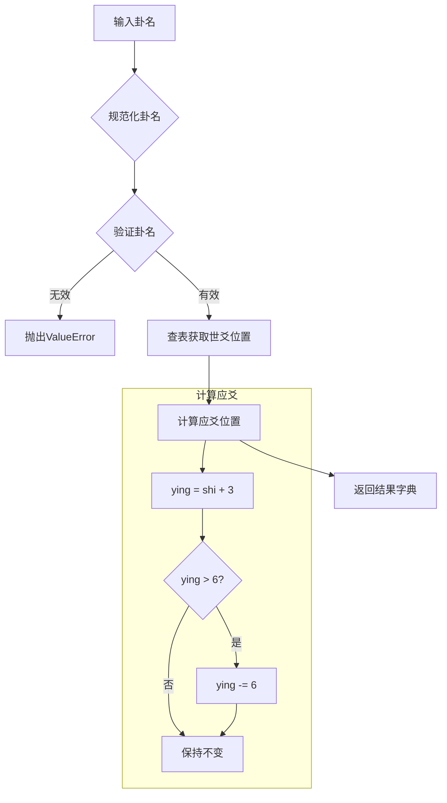

# 世应推算模块设计方案

## 一、模块概述

### 1.1 功能描述
根据64卦卦名自动推算世爻和应爻位置，严格遵循六爻正统规则。

### 1.2 核心规则
- **世应唯一绑定卦象**：同一个卦，世爻、应爻位置永远固定不变
- **应爻计算公式**：应爻位置 = 世爻位置 + 3（若结果 > 6，则减 6）
- **八宫卦序映射**：每宫8卦，世位固定

## 二、模块架构

```
shi_ying/
├── __init__.py      # 模块导出
├── core.py          # 核心算法（SHIYING_MAP + get_shi_ying）
├── utils.py         # 工具函数（格式化输出等）
└── README.md        # 模块文档
```

## 三、核心数据结构

### 3.1 世应映射字典（SHIYING_MAP）

```python
SHIYING_MAP = {
    # 乾宫八卦（金）
    "乾为天": 6, "天风姤": 1, "天山遁": 2, "天地否": 3,
    "风地观": 4, "山地剥": 5, "火地晋": 4, "火天大有": 3,
    
    # 兑宫八卦（金）
    "兑为泽": 6, "泽水困": 1, "泽地萃": 2, "泽山咸": 3,
    "水山蹇": 4, "地山谦": 5, "雷山小过": 4, "雷泽归妹": 3,
    
    # 离宫八卦（火）
    "离为火": 6, "火山旅": 1, "火风鼎": 2, "火水未济": 3,
    "山水蒙": 4, "风水涣": 5, "天水讼": 4, "天火同人": 3,
    
    # 震宫八卦（木）
    "震为雷": 6, "雷地豫": 1, "雷水解": 2, "雷风恒": 3,
    "地风升": 4, "水风井": 5, "泽风大过": 4, "泽雷随": 3,
    
    # 巽宫八卦（木）
    "巽为风": 6, "风天小畜": 1, "风火家人": 2, "风雷益": 3,
    "天雷无妄": 4, "火雷噬嗑": 5, "山雷颐": 4, "山风蛊": 3,
    
    # 坎宫八卦（水）
    "坎为水": 6, "水泽节": 1, "水雷屯": 2, "水火既济": 3,
    "泽火革": 4, "雷火丰": 5, "地火明夷": 4, "地水师": 3,
    
    # 艮宫八卦（土）
    "艮为山": 6, "山火贲": 1, "山天大畜": 2, "山泽损": 3,
    "火泽睽": 4, "天泽履": 5, "风泽中孚": 4, "风山渐": 3,
    
    # 坤宫八卦（土）
    "坤为地": 6, "地雷复": 1, "地泽临": 2, "地天泰": 3,
    "雷天大壮": 4, "泽天夬": 5, "水天需": 4, "水地比": 3,
}
```

### 3.2 爻位名称常量

```python
YAO_NAMES = ["初爻", "二爻", "三爻", "四爻", "五爻", "上爻"]
```

## 四、核心函数设计

### 4.1 主函数：get_shi_ying

```python
def get_shi_ying(gua_name: str) -> dict:
    """
    根据64卦卦名获取世应位置
    
    Args:
        gua_name: 标准卦名，如 "乾为天"、"风天小畜"
    
    Returns:
        dict: {"shi": 世位(1-6), "ying": 应位(1-6)}
    
    Raises:
        ValueError: 卦名无效时抛出异常
    """
```

### 4.2 辅助函数

```python
def normalize_gua_name(gua_name: str) -> str:
    """规范化卦名（去除空格、统一全半角）"""

def calculate_ying(shi: int) -> int:
    """根据世爻位置计算应爻位置"""

def get_yao_name(position: int) -> str:
    """获取爻位名称"""

def validate_gua_name(gua_name: str) -> bool:
    """验证卦名是否有效"""
```

## 五、工具函数设计（utils.py）

```python
def format_shi_ying_result(result: dict, gua_name: str = None) -> str:
    """
    格式化输出世应结果
    
    Args:
        result: get_shi_ying返回的结果字典
        gua_name: 可选的卦名
    
    Returns:
        str: 格式化后的字符串
        例如：
        卦象：风天小畜
        世爻：初爻（1）
        应爻：四爻（4）
    """

def get_shi_ying_info(gua_name: str) -> dict:
    """
    获取完整的世应信息
    
    Returns:
        dict: {
            "gua_name": "风天小畜",
            "shi": 1,
            "ying": 4,
            "shi_name": "初爻",
            "ying_name": "四爻"
        }
    """
```

## 六、测试用例

| 输入卦名 | 世爻 | 应爻 |
|---------|------|------|
| 乾为天 | 6 | 3 |
| 天风姤 | 1 | 4 |
| 天山遁 | 2 | 5 |
| 风天小畜 | 1 | 4 |
| 火天大有 | 3 | 6 |
| 坤为地 | 6 | 3 |
| 水天需 | 4 | 1 |
| 山风蛊 | 3 | 6 |

## 七、与现有模块的集成

### 7.1 与gua64模块集成

```python
# 示例：从六爻数组获取世应
from gua64 import calculate_gua
from shi_ying import get_shi_ying

# 计算卦象
gua_result = calculate_gua([1, 1, 1, 1, 1, 1])
gua_name = gua_result['ben_gua']['name']

# 获取世应
shi_ying = get_shi_ying(gua_name)
```

### 7.2 模块导出设计

```python
# shi_ying/__init__.py
from .core import (
    SHIYING_MAP,
    YAO_NAMES,
    get_shi_ying,
    calculate_ying,
    normalize_gua_name,
    validate_gua_name,
    get_yao_name,
)

from .utils import (
    format_shi_ying_result,
    get_shi_ying_info,
    print_shi_ying_result,
)

__all__ = [
    'SHIYING_MAP',
    'YAO_NAMES',
    'get_shi_ying',
    'calculate_ying',
    'normalize_gua_name',
    'validate_gua_name',
    'get_yao_name',
    'format_shi_ying_result',
    'get_shi_ying_info',
    'print_shi_ying_result',
]
```

## 八、文件清单

| 文件路径 | 描述 |
|---------|------|
| `shi_ying/__init__.py` | 模块导出 |
| `shi_ying/core.py` | 核心算法实现 |
| `shi_ying/utils.py` | 工具函数 |
| `shi_ying/README.md` | 模块文档 |
| `test_shi_ying.py` | 测试文件 |

## 九、执行流程图



## 十、注意事项

1. **输入容错**：支持全半角空格、多余空格自动处理
2. **无第三方依赖**：仅使用Python内置库
3. **完整64卦覆盖**：字典必须包含全部64卦
4. **与gua64模块兼容**：卦名必须与gua64模块的GUA64_NAMES完全一致