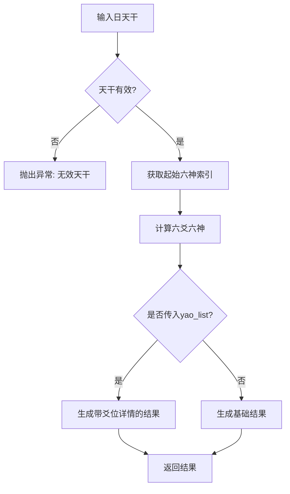

# 六神排盘功能实现计划

## 一、需求概述

根据《卜筮正宗》六爻六神排盘的正统规则，实现六神自动排盘功能，与现有的硬币起卦、数字起卦功能无缝兼容。

**重要：新建独立文件夹 `six_gods/` 来保存六神排盘算法模块。**

## 二、正统规则（不可修改）

### 2.1 六神固定循环顺序
```python
SIX_GODS = ["青龙", "朱雀", "勾陈", "螣蛇", "白虎", "玄武"]
```

### 2.2 日天干→初爻起始六神映射
| 天干 | 起始六神 | 列表索引 |
|------|----------|----------|
| 甲、乙 | 青龙 | 0 |
| 丙、丁 | 朱雀 | 1 |
| 戊 | 勾陈 | 2 |
| 己 | 螣蛇 | 3 |
| 庚、辛 | 白虎 | 4 |
| 壬、癸 | 玄武 | 5 |

### 2.3 排盘规则
- **排盘顺序**：从初爻到上爻（自下而上）顺排
- **核心公式**：`六神索引 = (起始索引 + 爻位偏移量) % 6`
  - 初爻偏移量 = 0
  - 二爻偏移量 = 1
  - 三爻偏移量 = 2
  - 四爻偏移量 = 3
  - 五爻偏移量 = 4
  - 上爻偏移量 = 5

## 三、现有代码分析

### 3.1 现有模块结构
```
6yao/
├── divination.py      # 核心起卦模块
├── main.py            # 交互式主程序
├── stroke_counter.py  # 笔画计算模块
└── test_divination.py # 测试文件
```

### 3.2 现有输出格式
- 六爻列表：`[初爻, 二爻, 三爻, 四爻, 五爻, 上爻]`
- 爻位名称：`["初爻", "二爻", "三爻", "四爻", "五爻", "上爻"]`
- 爻值定义：
  - `0` = 少阴（阴爻，静）
  - `1` = 少阳（阳爻，静）或 老阳（阳爻，动）
  - `2` = 老阴（阴爻，动）
  - `3` = 老阳（阳爻，动）

### 3.3 兼容性要求
- 需要兼容 `yao_list` 参数格式
- 输出格式需与现有起卦结果统一

## 四、实现方案

### 4.1 新建模块文件
创建 `six_gods.py` 文件，独立封装六神排盘功能。

### 4.2 核心函数设计

```python
def calculate_six_gods(day_tiangan: str, yao_list: list = None) -> dict:
    """
    六神排盘核心函数
    
    Args:
        day_tiangan: 起卦日的天干（甲、乙、丙、丁、戊、己、庚、辛、壬、癸）
        yao_list: 可选，六爻数组，用于匹配爻位输出
    
    Returns:
        dict: {
            'day_tiangan': 天干,
            'start_god': 初爻起始六神,
            'start_index': 起始索引,
            'six_gods_list': 六神列表[初爻到上爻],
            'yao_details': 爻位详情（若传入yao_list）
        }
    
    Raises:
        ValueError: 无效天干输入时抛出异常
    """
```

### 4.3 辅助函数设计

```python
def get_tiangan_index(day_tiangan: str) -> int:
    """根据天干获取六神起始索引"""

def format_six_gods_result(result: dict) -> str:
    """格式化输出六神排盘结果"""
```

### 4.4 与现有模块集成
在 `divination.py` 中添加获取日天干的功能，并在返回结果中包含天干信息。

## 五、测试用例验证

### 测试用例1：天干="甲"
- 起始索引 = 0（青龙）
- 预期输出：
  - 初爻：青龙
  - 二爻：朱雀
  - 三爻：勾陈
  - 四爻：螣蛇
  - 五爻：白虎
  - 上爻：玄武

### 测试用例2：天干="己"
- 起始索引 = 3（螣蛇）
- 预期输出：
  - 初爻：螣蛇
  - 二爻：白虎
  - 三爻：玄武
  - 四爻：青龙
  - 五爻：朱雀
  - 上爻：勾陈

### 测试用例3：天干="癸"
- 起始索引 = 5（玄武）
- 预期输出：
  - 初爻：玄武
  - 二爻：青龙
  - 三爻：朱雀
  - 四爻：勾陈
  - 五爻：螣蛇
  - 上爻：白虎

### 测试用例4：无效天干="子"
- 预期：抛出 ValueError，提示"无效的天干，请输入十天干之一：甲、乙、丙、丁、戊、己、庚、辛、壬、癸"

## 六、文件结构

```
6yao/
├── divination.py          # 核心起卦模块（需更新）
├── six_gods/              # 六神排盘模块文件夹（新建）
│   ├── __init__.py        # 模块初始化文件
│   ├── core.py            # 六神排盘核心算法
│   └── utils.py           # 辅助函数（格式化输出等）
├── main.py                # 交互式主程序（需更新）
├── stroke_counter.py      # 笔画计算模块
├── test_divination.py     # 测试文件
└── test_six_gods.py       # 六神测试文件（新建）
```

## 七、实现步骤

1. **创建 six_gods/ 文件夹及模块**
   - 创建 `six_gods/__init__.py` 模块初始化
   - 创建 `six_gods/core.py` 定义六神常量列表、天干映射字典、核心计算函数
   - 创建 `six_gods/utils.py` 实现格式化输出函数
   - 实现输入校验

2. **编写测试用例**
   - 创建 test_six_gods.py
   - 验证四个测试场景

3. **更新 divination.py**
   - 添加获取日天干的辅助函数
   - 在起卦结果中包含天干信息

4. **更新 main.py**
   - 集成六神排盘功能
   - 添加六神排盘菜单选项

5. **编写文档**
   - 更新 README.md
   - 添加使用示例

## 八、流程图



## 九、注意事项

1. **严格遵循正统规则**：所有映射和计算公式不可修改
2. **输入校验**：仅接受十天干（甲、乙、丙、丁、戊、己、庚、辛、壬、癸）
3. **输出格式统一**：与现有起卦结果格式保持一致
4. **模块化设计**：独立函数，便于被其他模块调用
5. **无第三方依赖**：仅使用Python内置库